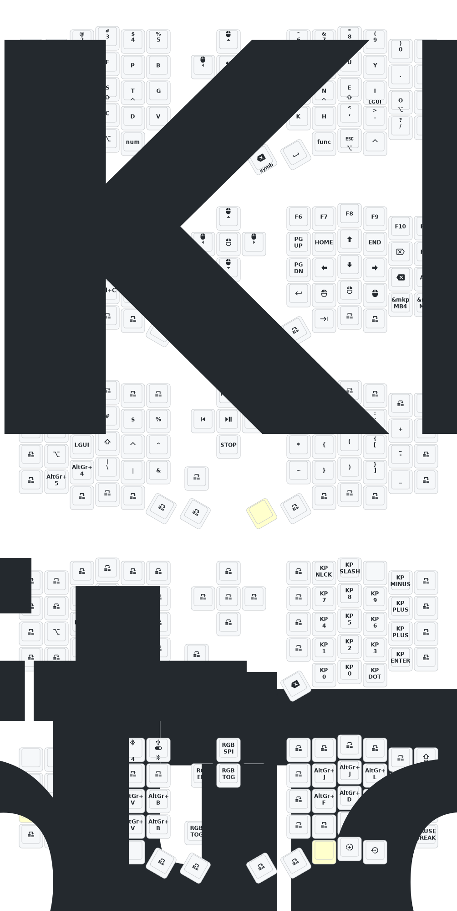

 # ZMK Sofle (dongle mode) config

This repository contains the ZMK configuration (shields, keymap, and GitHub Actions build) for an **Eyelash Sofle** split keyboard running in **dongle/receiver mode**.

## Hardware

- Target controller board: `nice_nano_v2`
- SoC: Nordic nRF52840
- CPU architecture: Arm Cortex-M4F

## What this repo builds

GitHub Actions builds the following firmware images (see `build.yaml`):

- `eyelash_sofle_central_dongle` (the **dongle/receiver**, acts as the ZMK “central”)
- `eyelash_sofle_peripheral_left` (left half)
- `eyelash_sofle_peripheral_right` (right half)
- `settings_reset` (clears stored settings/pairings)

## Quick start (GitHub Actions)

1. Fork this repository.
2. Go to **Actions** and enable workflows (if prompted).
3. Make changes (keymap/config) and commit.
4. Open the latest **Build ZMK firmware** run and download the artifact(s).
5. Flash the correct `.uf2` to the dongle/left/right as needed.

## Repo structure (matches ZMK docs)

This repository is structured like a standard ZMK “user config” repo as described in:

- https://zmk.dev/docs/user-setup
- https://zmk.dev/docs/customization

Key locations:

- `build.yaml`: GitHub Actions build matrix (which boards/shields get built)
- `config/`: keymap and Kconfig options (`.keymap` / `.conf`)
- `boards/shields/`: custom shield definitions (hardware + overlays)
- `config/west.yml` + `zephyr/module.yml`: pin ZMK version and include extra Zephyr/ZMK modules

## Live keymap changes (ZMK Studio)

This repo is set up to support **ZMK Studio** for live keymap changes (no rebuild/reflash for supported edits).

- ZMK Studio guide: docs/zmk-studio.md
- Official docs: https://zmk.dev/docs/features/studio

Important note from the official docs: once you start managing the keymap via ZMK Studio, future edits to the `.keymap` file will not apply unless you use **“Restore Stock Settings”** in ZMK Studio.

## Documentation

- Dongle usage and setup: docs/dongle-usage.md
- Keymap modification (GitHub Actions + flashing): docs/keymap.md

## Keymap diagram

## Changelog

- 2024/12/21: Added support for ZMK Studio (refresh the left-hand firmware per original note).
- 2024/10/24: Reduced power consumption; fixed RGB power auto shut-off.

